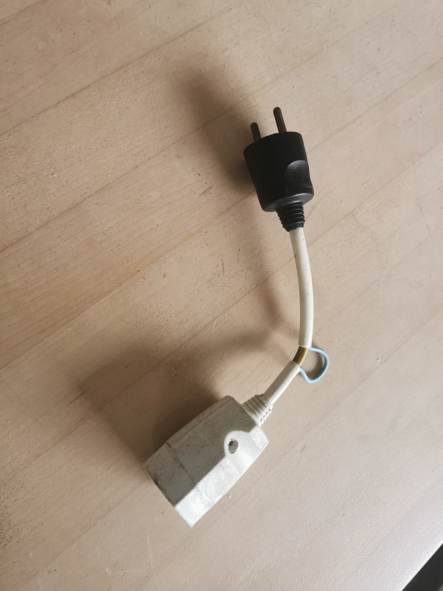

# Hardware setup

## sensor

I am using SCT13-10 sensor.  
It gererate 1v voltage for every 10 ampere going throught the clamp.

First, I've build a kind of adapter so I can connect easyly any workload and use the clamp.

