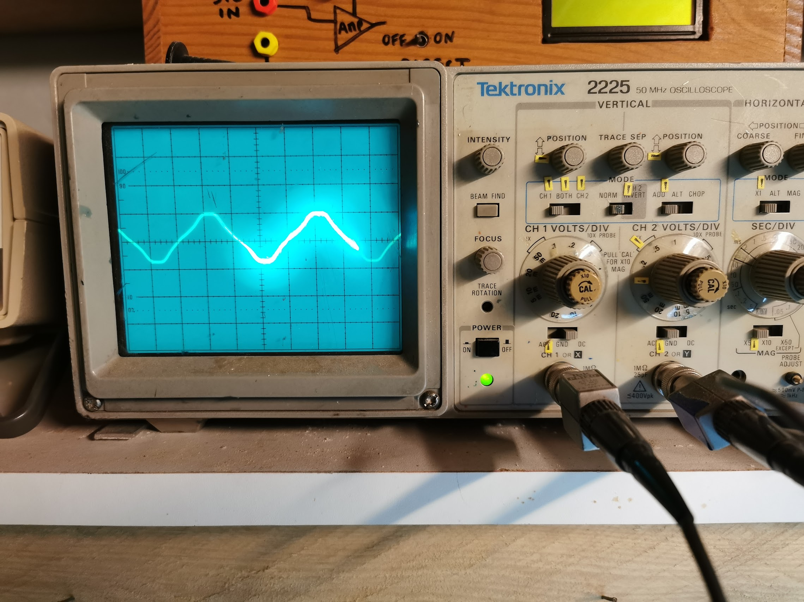

# Hardware setup

## sensor

I am using SCT13-10 sensor.  
It gererate 1v voltage for every 10 ampere going throught the clamp.

First, I've build a kind of adapter so I can connect easyly any workload and use the clamp.

Then I mesure output with a small heater rated 1600w.
We can see a kind of sinewave at 50hz (like power suply).

Voluate mesure is 1 peak to peak centered around 0v.

Given the sensor, it give :
    0.5v x 10A/v = 5A
    5A *230v = 1150 W

It does not match with the heater suposed power. 
I don't know why but  I don't dig further. When I swith the heater to lower temp, voltage cut by an half so I guess there is no issue.
I guess the hearter has less power than told.

But as my analog input on the ESN need to be ffed with 0 -3.3v, I need to rectify the input.
I do so with a voltage divider (2 10kohm resistor) that will give me a virtual groud aourd 1,6v.
I also a a capacitor for proper decoupling.

This the final signal with the upper schematics.
I still have the pseudo sine wave of 1v p2p but centered around 1.6v.

